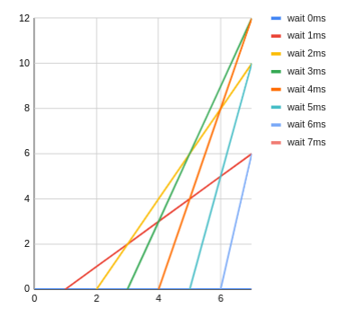
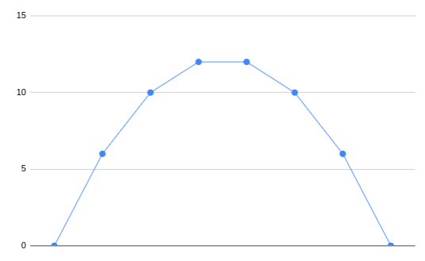

## Why?

I am writing this down just for fun. It is the mathematical proof why you
will always get the best distance when holding the button for half of the
time of the race.

## Distance in function of time

In this graph the distance traveled is plotted in function of the time.
Each line represents a different amount of ms waited. We see that, as stated
in the task description, when we start immediately we have speed and when we
wait too long, we have no time to use the built-up speed.

These are simple linear functions with a different gradient depending on the
wait time before releasing the button:

- 0ms: $`f(s) = 0`$
- 1ms: $`f(s) = t - 1`$
- 2ms: $`f(s) = 2t - 4`$
- 3ms: $`f(s) = 3t - 9`$
- 4ms: $`f(s) = 4t - 16`$
- 5ms: $`f(s) = 5t - 25`$
- 6ms: $`f(s) = 6t - 36`$
- 7ms: $`f(s) = 7t - 49`$

When the slope increases, the function needs delay as much ms before starting.
This results in the following function:

$$
s = t_{hold}t_{race} - t_{hold}^2
$$

In which $`s`$ is the distance travelled, $`t_{hold}`$ is the time we hold
the button and `t_{race}` is the time at which we need to know the distance.

## Distance travelled in function of the hold-time

With the function from the previous chapter we can calculate what the maximum
distance is for a given time. We just need to make the `t_{race}` parameter
fixed and use the `t_{hold}` parameter as variable. This results in a quadratic
equation.

$$
s = t_{hold}t_{race} - t_{hold}^2
$$

This second graph shows the eventual distance travelled in function of the time
we waited to release the button. Here we see that the highest point is indeed
the middle of the graph. This feels intuitively, but let's back it up with
numbers.

To calculate the maximum of a quadratic equation we need to know the point where
the gradient is 0. That we can do using the derivative of the function.

$$
\dfrac{d}{dt}= t_{race} - 2t_{hold}
$$

Which can be rewritten as:

$$
t_{hold} = \dfrac{t_race}{2}
$$

This formula confirms the intuition that we should half the race time to get the
time to release the button. In the example this results in $`\fraq{7}{2}`$.
This is verified by looking ath the graph in which we see the best tim is
between 3 and 4.

## Getting time at which the record holder released the button

For the task we need to get the number of possible hold-times to win the race.
To do this, we first need to figure out at which time the record holder
released the button. To do that we can use the quadratic equation again:

$$
0 = - t_{hold}^2 + t_{race}t_{hold} - s
$$

Which translates in the example to

$$
0 = - t_{hold}^2 + 7t_{hold} -9
$$

To get the time for a given distance we need to solve this equation to get
$`t_race`$:

$$
t_{record} = \dfrac 
{-t_{race} \pm\sqrt{t_{race}^2 - 4\cdot(-1)\cdot(-s)}}
{2\cdot(-1)}
 = \dfrac 
{-t_{race} \pm\sqrt{t_{race}^2 - 4s}} 
{-2}
$$

Again using the example we get

$$
t_{record} = \dfrac {-7 \pm\sqrt{7^2 - 4\cdot9}} {-2}
$$

Which yields 2 results:

- $`t_{recod1} = 1.697`$
- $`t_{recod2} = 5.302`$

## Solving the task

To solve the task, we need to find all the integer values which yield a 
greater result than the record holder. Or in other words all the integer values
between them:

$$
n = \lceil t_{record2} - 1 \rceil - \lfloor t_{record1} + 1 \rfloor
$$

Which results for the example in:

$$
n = \lceil 5.302 - 1 \rceil - \lfloor 1.697 + 1 \rfloor + 1
= 5 - 2 + 1
= 4
$$

Notice the adding 1 and then flooring of the numbers. This is so that we 
ensure the number is larger than the record numbers. E.g.: in the third 
example of the task we see that the record numbers are 10 and 20. When we 
ceil/floor those numbers, they remain 10 and 20. For the correct solution 
however, we need a number higher/lower than that.

The addition of 1 to the upper limit is because we want the upper limit to be 
inclusive. (5 - 2 = 3 but we want all numbers 2, 3, 4, 5)